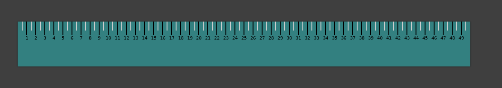

# Ruler

A Simple tool to measure pixels on the screen.



# Features

* Moving on the screen with mouse cursor (click and drag).
* Rotation
* Config file - todo

# Hotkeys

```
q = quit 
r = rotate
```

# Build

```sh
meson build
cd build
ninja
./ruler
```


